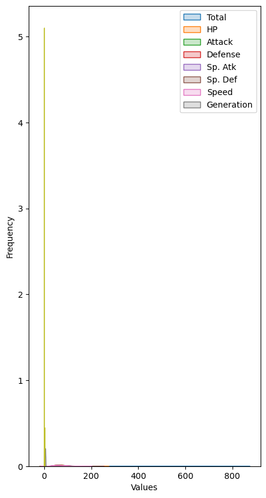

```python
import numpy as np
import pandas as pd
import matplotlib.pyplot as plt
import matplotlib
import seaborn as sns
import plotly.express as px

from sklearn.preprocessing import LabelEncoder, StandardScaler
from sklearn.model_selection import train_test_split
from sklearn.decomposition import PCA

import tensorflow as tf

%matplotlib inline
```

Goal: predict if a pokémon is legendary or not


```python
dataset = pd.read_csv("Pokemon.csv")
```


```python
dataset
```


<div>
<style scoped>
    .dataframe tbody tr th:only-of-type {
        vertical-align: middle;
    }

    .dataframe tbody tr th {
        vertical-align: top;
    }

    .dataframe thead th {
        text-align: right;
    }
</style>
<table border="1" class="dataframe">
  <thead>
    <tr style="text-align: right;">
      <th></th>
      <th>#</th>
      <th>Name</th>
      <th>Type 1</th>
      <th>Type 2</th>
      <th>Total</th>
      <th>HP</th>
      <th>Attack</th>
      <th>Defense</th>
      <th>Sp. Atk</th>
      <th>Sp. Def</th>
      <th>Speed</th>
      <th>Generation</th>
      <th>Legendary</th>
    </tr>
  </thead>
  <tbody>
    <tr>
      <th>0</th>
      <td>1</td>
      <td>Bulbasaur</td>
      <td>Grass</td>
      <td>Poison</td>
      <td>318</td>
      <td>45</td>
      <td>49</td>
      <td>49</td>
      <td>65</td>
      <td>65</td>
      <td>45</td>
      <td>1</td>
      <td>False</td>
    </tr>
    <tr>
      <th>1</th>
      <td>2</td>
      <td>Ivysaur</td>
      <td>Grass</td>
      <td>Poison</td>
      <td>405</td>
      <td>60</td>
      <td>62</td>
      <td>63</td>
      <td>80</td>
      <td>80</td>
      <td>60</td>
      <td>1</td>
      <td>False</td>
    </tr>
    <tr>
      <th>2</th>
      <td>3</td>
      <td>Venusaur</td>
      <td>Grass</td>
      <td>Poison</td>
      <td>525</td>
      <td>80</td>
      <td>82</td>
      <td>83</td>
      <td>100</td>
      <td>100</td>
      <td>80</td>
      <td>1</td>
      <td>False</td>
    </tr>
    <tr>
      <th>3</th>
      <td>3</td>
      <td>VenusaurMega Venusaur</td>
      <td>Grass</td>
      <td>Poison</td>
      <td>625</td>
      <td>80</td>
      <td>100</td>
      <td>123</td>
      <td>122</td>
      <td>120</td>
      <td>80</td>
      <td>1</td>
      <td>False</td>
    </tr>
    <tr>
      <th>4</th>
      <td>4</td>
      <td>Charmander</td>
      <td>Fire</td>
      <td>NaN</td>
      <td>309</td>
      <td>39</td>
      <td>52</td>
      <td>43</td>
      <td>60</td>
      <td>50</td>
      <td>65</td>
      <td>1</td>
      <td>False</td>
    </tr>
    <tr>
      <th>...</th>
      <td>...</td>
      <td>...</td>
      <td>...</td>
      <td>...</td>
      <td>...</td>
      <td>...</td>
      <td>...</td>
      <td>...</td>
      <td>...</td>
      <td>...</td>
      <td>...</td>
      <td>...</td>
      <td>...</td>
    </tr>
    <tr>
      <th>795</th>
      <td>719</td>
      <td>Diancie</td>
      <td>Rock</td>
      <td>Fairy</td>
      <td>600</td>
      <td>50</td>
      <td>100</td>
      <td>150</td>
      <td>100</td>
      <td>150</td>
      <td>50</td>
      <td>6</td>
      <td>True</td>
    </tr>
    <tr>
      <th>796</th>
      <td>719</td>
      <td>DiancieMega Diancie</td>
      <td>Rock</td>
      <td>Fairy</td>
      <td>700</td>
      <td>50</td>
      <td>160</td>
      <td>110</td>
      <td>160</td>
      <td>110</td>
      <td>110</td>
      <td>6</td>
      <td>True</td>
    </tr>
    <tr>
      <th>797</th>
      <td>720</td>
      <td>HoopaHoopa Confined</td>
      <td>Psychic</td>
      <td>Ghost</td>
      <td>600</td>
      <td>80</td>
      <td>110</td>
      <td>60</td>
      <td>150</td>
      <td>130</td>
      <td>70</td>
      <td>6</td>
      <td>True</td>
    </tr>
    <tr>
      <th>798</th>
      <td>720</td>
      <td>HoopaHoopa Unbound</td>
      <td>Psychic</td>
      <td>Dark</td>
      <td>680</td>
      <td>80</td>
      <td>160</td>
      <td>60</td>
      <td>170</td>
      <td>130</td>
      <td>80</td>
      <td>6</td>
      <td>True</td>
    </tr>
    <tr>
      <th>799</th>
      <td>721</td>
      <td>Volcanion</td>
      <td>Fire</td>
      <td>Water</td>
      <td>600</td>
      <td>80</td>
      <td>110</td>
      <td>120</td>
      <td>130</td>
      <td>90</td>
      <td>70</td>
      <td>6</td>
      <td>True</td>
    </tr>
  </tbody>
</table>
<p>800 rows × 13 columns</p>
</div>


# Data cleaning


```python
data_raw = dataset.copy()
```


```python
dataset.info()
```

    <class 'pandas.core.frame.DataFrame'>
    RangeIndex: 800 entries, 0 to 799
    Data columns (total 13 columns):
     #   Column      Non-Null Count  Dtype 
    ---  ------      --------------  ----- 
     0   #           800 non-null    int64 
     1   Name        800 non-null    object
     2   Type 1      800 non-null    object
     3   Type 2      414 non-null    object
     4   Total       800 non-null    int64 
     5   HP          800 non-null    int64 
     6   Attack      800 non-null    int64 
     7   Defense     800 non-null    int64 
     8   Sp. Atk     800 non-null    int64 
     9   Sp. Def     800 non-null    int64 
     10  Speed       800 non-null    int64 
     11  Generation  800 non-null    int64 
     12  Legendary   800 non-null    bool  
    dtypes: bool(1), int64(9), object(3)
    memory usage: 75.9+ KB
    


```python
dataset.isna().sum()
```


    #               0
    Name            0
    Type 1          0
    Type 2        386
    Total           0
    HP              0
    Attack          0
    Defense         0
    Sp. Atk         0
    Sp. Def         0
    Speed           0
    Generation      0
    Legendary       0
    dtype: int64


There are 386 rows in the dataset where the column 'Type 2' has NULL values, so there is no need to considerate it.
Also, the columns '#' and 'Name' won't help at the recognization as well, so they should be dropped.


```python
dataset = dataset.drop(['#', 'Name', 'Type 2'], axis=1)
```


```python
dataset['Legendary'] = dataset['Legendary'].astype(int)
```

# EDA
(exploratory data analysis)


```python
dataset
```


<div>
<style scoped>
    .dataframe tbody tr th:only-of-type {
        vertical-align: middle;
    }

    .dataframe tbody tr th {
        vertical-align: top;
    }

    .dataframe thead th {
        text-align: right;
    }
</style>
<table border="1" class="dataframe">
  <thead>
    <tr style="text-align: right;">
      <th></th>
      <th>Type 1</th>
      <th>Total</th>
      <th>HP</th>
      <th>Attack</th>
      <th>Defense</th>
      <th>Sp. Atk</th>
      <th>Sp. Def</th>
      <th>Speed</th>
      <th>Generation</th>
      <th>Legendary</th>
    </tr>
  </thead>
  <tbody>
    <tr>
      <th>0</th>
      <td>Grass</td>
      <td>318</td>
      <td>45</td>
      <td>49</td>
      <td>49</td>
      <td>65</td>
      <td>65</td>
      <td>45</td>
      <td>1</td>
      <td>0</td>
    </tr>
    <tr>
      <th>1</th>
      <td>Grass</td>
      <td>405</td>
      <td>60</td>
      <td>62</td>
      <td>63</td>
      <td>80</td>
      <td>80</td>
      <td>60</td>
      <td>1</td>
      <td>0</td>
    </tr>
    <tr>
      <th>2</th>
      <td>Grass</td>
      <td>525</td>
      <td>80</td>
      <td>82</td>
      <td>83</td>
      <td>100</td>
      <td>100</td>
      <td>80</td>
      <td>1</td>
      <td>0</td>
    </tr>
    <tr>
      <th>3</th>
      <td>Grass</td>
      <td>625</td>
      <td>80</td>
      <td>100</td>
      <td>123</td>
      <td>122</td>
      <td>120</td>
      <td>80</td>
      <td>1</td>
      <td>0</td>
    </tr>
    <tr>
      <th>4</th>
      <td>Fire</td>
      <td>309</td>
      <td>39</td>
      <td>52</td>
      <td>43</td>
      <td>60</td>
      <td>50</td>
      <td>65</td>
      <td>1</td>
      <td>0</td>
    </tr>
    <tr>
      <th>...</th>
      <td>...</td>
      <td>...</td>
      <td>...</td>
      <td>...</td>
      <td>...</td>
      <td>...</td>
      <td>...</td>
      <td>...</td>
      <td>...</td>
      <td>...</td>
    </tr>
    <tr>
      <th>795</th>
      <td>Rock</td>
      <td>600</td>
      <td>50</td>
      <td>100</td>
      <td>150</td>
      <td>100</td>
      <td>150</td>
      <td>50</td>
      <td>6</td>
      <td>1</td>
    </tr>
    <tr>
      <th>796</th>
      <td>Rock</td>
      <td>700</td>
      <td>50</td>
      <td>160</td>
      <td>110</td>
      <td>160</td>
      <td>110</td>
      <td>110</td>
      <td>6</td>
      <td>1</td>
    </tr>
    <tr>
      <th>797</th>
      <td>Psychic</td>
      <td>600</td>
      <td>80</td>
      <td>110</td>
      <td>60</td>
      <td>150</td>
      <td>130</td>
      <td>70</td>
      <td>6</td>
      <td>1</td>
    </tr>
    <tr>
      <th>798</th>
      <td>Psychic</td>
      <td>680</td>
      <td>80</td>
      <td>160</td>
      <td>60</td>
      <td>170</td>
      <td>130</td>
      <td>80</td>
      <td>6</td>
      <td>1</td>
    </tr>
    <tr>
      <th>799</th>
      <td>Fire</td>
      <td>600</td>
      <td>80</td>
      <td>110</td>
      <td>120</td>
      <td>130</td>
      <td>90</td>
      <td>70</td>
      <td>6</td>
      <td>1</td>
    </tr>
  </tbody>
</table>
<p>800 rows × 10 columns</p>
</div>


```python
numeric_columns = dataset.drop('Type 1', axis=1).columns 
```

Numeric columns will be the dataset without 'Type 1' column.


```python
correlation_matrix = dataset[numeric_columns].corr() #generate correlation matrix

plt.figure(figsize=(15,12))
sns.heatmap(correlation_matrix, annot=True, vmin=-1.0, vmax=1.0)
plt.show()
```


    

    


By the graph above, we can see that there is no feature that is super correlated (higher is 5, wich is 'Total') to the legendarie column. So, a combination of all features would be enough to predict if a poké is legendarie or not?


```python
plt.figure(figsize=(5,10))
for column in numeric_columns:
    sns.kdeplot(dataset[column], shade=True)
plt.legend(['Total', 'HP', 'Attack', 'Defense', 'Sp. Atk', 'Sp. Def', 'Speed', 'Generation']) 
plt.xlabel("Values")
plt.ylabel("Frequency")
plt.show()
```


    

    


The 'Total' and 'Generation' columns should not be included


```python
plt.figure(figsize=(20,10))
for column in ['HP', 'Attack', 'Defense', 'Sp. Atk', 'Sp. Def', 'Speed']:
    sns.kdeplot(dataset[column], shade=True)
plt.legend(['HP', 'Attack', 'Defense', 'Sp. Atk', 'Sp. Def', 'Speed']) 
plt.xlabel("Values")
plt.ylabel("Frequency")
plt.show()
```


    

    


# Preprocessing

## Encoding


```python
#convert 'type 1' column to indicators
def onehot_encode(df, column, prefix):
    df = df.copy()
    dummies = pd.get_dummies(df[column], prefix=prefix)
    df = pd.concat([df, dummies], axis=1)
    df = df.drop(column, axis=1)
    return df
```


```python
dataset = onehot_encode(dataset, 'Type 1', 't')
```


```python
dataset
```


<div>
<style scoped>
    .dataframe tbody tr th:only-of-type {
        vertical-align: middle;
    }

    .dataframe tbody tr th {
        vertical-align: top;
    }

    .dataframe thead th {
        text-align: right;
    }
</style>
<table border="1" class="dataframe">
  <thead>
    <tr style="text-align: right;">
      <th></th>
      <th>Total</th>
      <th>HP</th>
      <th>Attack</th>
      <th>Defense</th>
      <th>Sp. Atk</th>
      <th>Sp. Def</th>
      <th>Speed</th>
      <th>Generation</th>
      <th>Legendary</th>
      <th>t_Bug</th>
      <th>...</th>
      <th>t_Ghost</th>
      <th>t_Grass</th>
      <th>t_Ground</th>
      <th>t_Ice</th>
      <th>t_Normal</th>
      <th>t_Poison</th>
      <th>t_Psychic</th>
      <th>t_Rock</th>
      <th>t_Steel</th>
      <th>t_Water</th>
    </tr>
  </thead>
  <tbody>
    <tr>
      <th>0</th>
      <td>318</td>
      <td>45</td>
      <td>49</td>
      <td>49</td>
      <td>65</td>
      <td>65</td>
      <td>45</td>
      <td>1</td>
      <td>0</td>
      <td>0</td>
      <td>...</td>
      <td>0</td>
      <td>1</td>
      <td>0</td>
      <td>0</td>
      <td>0</td>
      <td>0</td>
      <td>0</td>
      <td>0</td>
      <td>0</td>
      <td>0</td>
    </tr>
    <tr>
      <th>1</th>
      <td>405</td>
      <td>60</td>
      <td>62</td>
      <td>63</td>
      <td>80</td>
      <td>80</td>
      <td>60</td>
      <td>1</td>
      <td>0</td>
      <td>0</td>
      <td>...</td>
      <td>0</td>
      <td>1</td>
      <td>0</td>
      <td>0</td>
      <td>0</td>
      <td>0</td>
      <td>0</td>
      <td>0</td>
      <td>0</td>
      <td>0</td>
    </tr>
    <tr>
      <th>2</th>
      <td>525</td>
      <td>80</td>
      <td>82</td>
      <td>83</td>
      <td>100</td>
      <td>100</td>
      <td>80</td>
      <td>1</td>
      <td>0</td>
      <td>0</td>
      <td>...</td>
      <td>0</td>
      <td>1</td>
      <td>0</td>
      <td>0</td>
      <td>0</td>
      <td>0</td>
      <td>0</td>
      <td>0</td>
      <td>0</td>
      <td>0</td>
    </tr>
    <tr>
      <th>3</th>
      <td>625</td>
      <td>80</td>
      <td>100</td>
      <td>123</td>
      <td>122</td>
      <td>120</td>
      <td>80</td>
      <td>1</td>
      <td>0</td>
      <td>0</td>
      <td>...</td>
      <td>0</td>
      <td>1</td>
      <td>0</td>
      <td>0</td>
      <td>0</td>
      <td>0</td>
      <td>0</td>
      <td>0</td>
      <td>0</td>
      <td>0</td>
    </tr>
    <tr>
      <th>4</th>
      <td>309</td>
      <td>39</td>
      <td>52</td>
      <td>43</td>
      <td>60</td>
      <td>50</td>
      <td>65</td>
      <td>1</td>
      <td>0</td>
      <td>0</td>
      <td>...</td>
      <td>0</td>
      <td>0</td>
      <td>0</td>
      <td>0</td>
      <td>0</td>
      <td>0</td>
      <td>0</td>
      <td>0</td>
      <td>0</td>
      <td>0</td>
    </tr>
    <tr>
      <th>...</th>
      <td>...</td>
      <td>...</td>
      <td>...</td>
      <td>...</td>
      <td>...</td>
      <td>...</td>
      <td>...</td>
      <td>...</td>
      <td>...</td>
      <td>...</td>
      <td>...</td>
      <td>...</td>
      <td>...</td>
      <td>...</td>
      <td>...</td>
      <td>...</td>
      <td>...</td>
      <td>...</td>
      <td>...</td>
      <td>...</td>
      <td>...</td>
    </tr>
    <tr>
      <th>795</th>
      <td>600</td>
      <td>50</td>
      <td>100</td>
      <td>150</td>
      <td>100</td>
      <td>150</td>
      <td>50</td>
      <td>6</td>
      <td>1</td>
      <td>0</td>
      <td>...</td>
      <td>0</td>
      <td>0</td>
      <td>0</td>
      <td>0</td>
      <td>0</td>
      <td>0</td>
      <td>0</td>
      <td>1</td>
      <td>0</td>
      <td>0</td>
    </tr>
    <tr>
      <th>796</th>
      <td>700</td>
      <td>50</td>
      <td>160</td>
      <td>110</td>
      <td>160</td>
      <td>110</td>
      <td>110</td>
      <td>6</td>
      <td>1</td>
      <td>0</td>
      <td>...</td>
      <td>0</td>
      <td>0</td>
      <td>0</td>
      <td>0</td>
      <td>0</td>
      <td>0</td>
      <td>0</td>
      <td>1</td>
      <td>0</td>
      <td>0</td>
    </tr>
    <tr>
      <th>797</th>
      <td>600</td>
      <td>80</td>
      <td>110</td>
      <td>60</td>
      <td>150</td>
      <td>130</td>
      <td>70</td>
      <td>6</td>
      <td>1</td>
      <td>0</td>
      <td>...</td>
      <td>0</td>
      <td>0</td>
      <td>0</td>
      <td>0</td>
      <td>0</td>
      <td>0</td>
      <td>1</td>
      <td>0</td>
      <td>0</td>
      <td>0</td>
    </tr>
    <tr>
      <th>798</th>
      <td>680</td>
      <td>80</td>
      <td>160</td>
      <td>60</td>
      <td>170</td>
      <td>130</td>
      <td>80</td>
      <td>6</td>
      <td>1</td>
      <td>0</td>
      <td>...</td>
      <td>0</td>
      <td>0</td>
      <td>0</td>
      <td>0</td>
      <td>0</td>
      <td>0</td>
      <td>1</td>
      <td>0</td>
      <td>0</td>
      <td>0</td>
    </tr>
    <tr>
      <th>799</th>
      <td>600</td>
      <td>80</td>
      <td>110</td>
      <td>120</td>
      <td>130</td>
      <td>90</td>
      <td>70</td>
      <td>6</td>
      <td>1</td>
      <td>0</td>
      <td>...</td>
      <td>0</td>
      <td>0</td>
      <td>0</td>
      <td>0</td>
      <td>0</td>
      <td>0</td>
      <td>0</td>
      <td>0</td>
      <td>0</td>
      <td>0</td>
    </tr>
  </tbody>
</table>
<p>800 rows × 27 columns</p>
</div>


## Splitting and Scaling


```python
y = dataset['Legendary']
x = dataset.drop('Legendary', axis=1)
```


```python
scaler = StandardScaler()

x = scaler.fit_transform(x)
```

# Training


```python
x_train, x_test, y_train, y_test = train_test_split(x, y, train_size=0.7, random_state=42)
```


```python
inputs = tf.keras.Input(shape=(26,))
#dense layers: every neuron in the dense layer takes the input from all the other neurons of the previous layer
x = tf.keras.layers.Dense(64, activation='relu')(inputs)
x = tf.keras.layers.Dense(64, activation='relu')(x)
outputs = tf.keras.layers.Dense(1, activation='sigmoid')(x)

model = tf.keras.Model(inputs=inputs, outputs=outputs)

model.compile(
    optimizer='adam',
    loss='binary_crossentropy',
    metrics=[
        'accuracy',
        tf.keras.metrics.AUC(name='auc')
    ]
)

batch_size = 32
epochs = 19

history = model.fit(
    x_train,
    y_train,
    validation_split=0.2,
    batch_size=batch_size,
    epochs=epochs,
    #everytime the loss starts plateauing, the learning rate will be lowered
    callbacks=[tf.keras.callbacks.ReduceLROnPlateau()]
)
```

    Epoch 1/19
    14/14 [==============================] - 1s 13ms/step - loss: 0.5037 - accuracy: 0.7991 - auc: 0.4107 - val_loss: 0.3945 - val_accuracy: 0.9018 - val_auc: 0.4190 - lr: 0.0010
    Epoch 2/19
    14/14 [==============================] - 0s 3ms/step - loss: 0.3051 - accuracy: 0.9129 - auc: 0.6174 - val_loss: 0.3176 - val_accuracy: 0.9018 - val_auc: 0.6557 - lr: 0.0010
    Epoch 3/19
    14/14 [==============================] - 0s 3ms/step - loss: 0.2397 - accuracy: 0.9129 - auc: 0.8432 - val_loss: 0.2681 - val_accuracy: 0.9018 - val_auc: 0.8020 - lr: 0.0010
    Epoch 4/19
    14/14 [==============================] - 0s 5ms/step - loss: 0.1980 - accuracy: 0.9174 - auc: 0.9219 - val_loss: 0.2303 - val_accuracy: 0.9107 - val_auc: 0.8839 - lr: 0.0010
    Epoch 5/19
    14/14 [==============================] - 0s 3ms/step - loss: 0.1674 - accuracy: 0.9308 - auc: 0.9615 - val_loss: 0.2096 - val_accuracy: 0.9107 - val_auc: 0.9176 - lr: 0.0010
    Epoch 6/19
    14/14 [==============================] - 0s 3ms/step - loss: 0.1463 - accuracy: 0.9330 - auc: 0.9724 - val_loss: 0.1866 - val_accuracy: 0.9018 - val_auc: 0.9410 - lr: 0.0010
    Epoch 7/19
    14/14 [==============================] - 0s 3ms/step - loss: 0.1289 - accuracy: 0.9442 - auc: 0.9789 - val_loss: 0.1727 - val_accuracy: 0.9107 - val_auc: 0.9469 - lr: 0.0010
    Epoch 8/19
    14/14 [==============================] - 0s 3ms/step - loss: 0.1154 - accuracy: 0.9509 - auc: 0.9826 - val_loss: 0.1616 - val_accuracy: 0.9196 - val_auc: 0.9527 - lr: 0.0010
    Epoch 9/19
    14/14 [==============================] - 0s 3ms/step - loss: 0.1043 - accuracy: 0.9643 - auc: 0.9855 - val_loss: 0.1556 - val_accuracy: 0.9196 - val_auc: 0.9550 - lr: 0.0010
    Epoch 10/19
    14/14 [==============================] - 0s 3ms/step - loss: 0.0960 - accuracy: 0.9576 - auc: 0.9868 - val_loss: 0.1511 - val_accuracy: 0.9107 - val_auc: 0.9572 - lr: 0.0010
    Epoch 11/19
    14/14 [==============================] - 0s 3ms/step - loss: 0.0869 - accuracy: 0.9688 - auc: 0.9894 - val_loss: 0.1472 - val_accuracy: 0.9018 - val_auc: 0.9581 - lr: 0.0010
    Epoch 12/19
    14/14 [==============================] - 0s 3ms/step - loss: 0.0819 - accuracy: 0.9688 - auc: 0.9908 - val_loss: 0.1419 - val_accuracy: 0.9107 - val_auc: 0.9608 - lr: 0.0010
    Epoch 13/19
    14/14 [==============================] - 0s 3ms/step - loss: 0.0782 - accuracy: 0.9732 - auc: 0.9919 - val_loss: 0.1424 - val_accuracy: 0.9018 - val_auc: 0.9622 - lr: 0.0010
    Epoch 14/19
    14/14 [==============================] - 0s 3ms/step - loss: 0.0721 - accuracy: 0.9799 - auc: 0.9924 - val_loss: 0.1378 - val_accuracy: 0.9107 - val_auc: 0.9644 - lr: 0.0010
    Epoch 15/19
    14/14 [==============================] - 0s 3ms/step - loss: 0.0678 - accuracy: 0.9821 - auc: 0.9936 - val_loss: 0.1367 - val_accuracy: 0.9196 - val_auc: 0.9631 - lr: 0.0010
    Epoch 16/19
    14/14 [==============================] - 0s 3ms/step - loss: 0.0627 - accuracy: 0.9866 - auc: 0.9950 - val_loss: 0.1336 - val_accuracy: 0.9196 - val_auc: 0.9680 - lr: 0.0010
    Epoch 17/19
    14/14 [==============================] - 0s 3ms/step - loss: 0.0600 - accuracy: 0.9888 - auc: 0.9946 - val_loss: 0.1326 - val_accuracy: 0.9286 - val_auc: 0.9680 - lr: 0.0010
    Epoch 18/19
    14/14 [==============================] - 0s 3ms/step - loss: 0.0585 - accuracy: 0.9844 - auc: 0.9951 - val_loss: 0.1314 - val_accuracy: 0.9286 - val_auc: 0.9716 - lr: 0.0010
    Epoch 19/19
    14/14 [==============================] - 0s 3ms/step - loss: 0.0560 - accuracy: 0.9866 - auc: 0.9958 - val_loss: 0.1304 - val_accuracy: 0.9375 - val_auc: 0.9698 - lr: 0.0010
    

## Results


```python
fig_loss = px.line(
    history.history,
    y=['loss', 'val_loss'],
    labels={'x': "Epoch", 'y':"Loss"},
    title="Loss over time"
)

fig_loss.show()
```


<div>                            <div id="84b5aefc-9667-44d7-9536-ba7eae587eba" class="plotly-graph-div" style="height:525px; width:100%;"></div>            <script type="text/javascript">                require(["plotly"], function(Plotly) {                    window.PLOTLYENV=window.PLOTLYENV || {};                                    if (document.getElementById("84b5aefc-9667-44d7-9536-ba7eae587eba")) {                    Plotly.newPlot(                        "84b5aefc-9667-44d7-9536-ba7eae587eba",                        [{"hovertemplate":"variable=loss<br>index=%{x}<br>value=%{y}<extra></extra>","legendgroup":"loss","line":{"color":"#636efa","dash":"solid"},"marker":{"symbol":"circle"},"mode":"lines","name":"loss","orientation":"v","showlegend":true,"x":[0,1,2,3,4,5,6,7,8,9,10,11,12,13,14,15,16,17,18],"xaxis":"x","y":[0.5037499666213989,0.30513232946395874,0.2397305965423584,0.19796811044216156,0.16741684079170227,0.1462521255016327,0.12892454862594604,0.11542730778455734,0.10428046435117722,0.09602943807840347,0.08685777336359024,0.08186596632003784,0.07821369171142578,0.07211963087320328,0.06783729791641235,0.0627419576048851,0.060016751289367676,0.05851038172841072,0.056044358760118484],"yaxis":"y","type":"scatter"},{"hovertemplate":"variable=val_loss<br>index=%{x}<br>value=%{y}<extra></extra>","legendgroup":"val_loss","line":{"color":"#EF553B","dash":"solid"},"marker":{"symbol":"circle"},"mode":"lines","name":"val_loss","orientation":"v","showlegend":true,"x":[0,1,2,3,4,5,6,7,8,9,10,11,12,13,14,15,16,17,18],"xaxis":"x","y":[0.3945043683052063,0.3175615668296814,0.26813921332359314,0.23025505244731903,0.2095850259065628,0.18660330772399902,0.17274034023284912,0.16161905229091644,0.1555948555469513,0.15109336376190186,0.1471533477306366,0.14187689125537872,0.14239993691444397,0.13778431713581085,0.13667218387126923,0.13360749185085297,0.13261958956718445,0.13141374289989471,0.1303928792476654],"yaxis":"y","type":"scatter"}],                        {"template":{"data":{"histogram2dcontour":[{"type":"histogram2dcontour","colorbar":{"outlinewidth":0,"ticks":""},"colorscale":[[0.0,"#0d0887"],[0.1111111111111111,"#46039f"],[0.2222222222222222,"#7201a8"],[0.3333333333333333,"#9c179e"],[0.4444444444444444,"#bd3786"],[0.5555555555555556,"#d8576b"],[0.6666666666666666,"#ed7953"],[0.7777777777777778,"#fb9f3a"],[0.8888888888888888,"#fdca26"],[1.0,"#f0f921"]]}],"choropleth":[{"type":"choropleth","colorbar":{"outlinewidth":0,"ticks":""}}],"histogram2d":[{"type":"histogram2d","colorbar":{"outlinewidth":0,"ticks":""},"colorscale":[[0.0,"#0d0887"],[0.1111111111111111,"#46039f"],[0.2222222222222222,"#7201a8"],[0.3333333333333333,"#9c179e"],[0.4444444444444444,"#bd3786"],[0.5555555555555556,"#d8576b"],[0.6666666666666666,"#ed7953"],[0.7777777777777778,"#fb9f3a"],[0.8888888888888888,"#fdca26"],[1.0,"#f0f921"]]}],"heatmap":[{"type":"heatmap","colorbar":{"outlinewidth":0,"ticks":""},"colorscale":[[0.0,"#0d0887"],[0.1111111111111111,"#46039f"],[0.2222222222222222,"#7201a8"],[0.3333333333333333,"#9c179e"],[0.4444444444444444,"#bd3786"],[0.5555555555555556,"#d8576b"],[0.6666666666666666,"#ed7953"],[0.7777777777777778,"#fb9f3a"],[0.8888888888888888,"#fdca26"],[1.0,"#f0f921"]]}],"heatmapgl":[{"type":"heatmapgl","colorbar":{"outlinewidth":0,"ticks":""},"colorscale":[[0.0,"#0d0887"],[0.1111111111111111,"#46039f"],[0.2222222222222222,"#7201a8"],[0.3333333333333333,"#9c179e"],[0.4444444444444444,"#bd3786"],[0.5555555555555556,"#d8576b"],[0.6666666666666666,"#ed7953"],[0.7777777777777778,"#fb9f3a"],[0.8888888888888888,"#fdca26"],[1.0,"#f0f921"]]}],"contourcarpet":[{"type":"contourcarpet","colorbar":{"outlinewidth":0,"ticks":""}}],"contour":[{"type":"contour","colorbar":{"outlinewidth":0,"ticks":""},"colorscale":[[0.0,"#0d0887"],[0.1111111111111111,"#46039f"],[0.2222222222222222,"#7201a8"],[0.3333333333333333,"#9c179e"],[0.4444444444444444,"#bd3786"],[0.5555555555555556,"#d8576b"],[0.6666666666666666,"#ed7953"],[0.7777777777777778,"#fb9f3a"],[0.8888888888888888,"#fdca26"],[1.0,"#f0f921"]]}],"surface":[{"type":"surface","colorbar":{"outlinewidth":0,"ticks":""},"colorscale":[[0.0,"#0d0887"],[0.1111111111111111,"#46039f"],[0.2222222222222222,"#7201a8"],[0.3333333333333333,"#9c179e"],[0.4444444444444444,"#bd3786"],[0.5555555555555556,"#d8576b"],[0.6666666666666666,"#ed7953"],[0.7777777777777778,"#fb9f3a"],[0.8888888888888888,"#fdca26"],[1.0,"#f0f921"]]}],"mesh3d":[{"type":"mesh3d","colorbar":{"outlinewidth":0,"ticks":""}}],"scatter":[{"fillpattern":{"fillmode":"overlay","size":10,"solidity":0.2},"type":"scatter"}],"parcoords":[{"type":"parcoords","line":{"colorbar":{"outlinewidth":0,"ticks":""}}}],"scatterpolargl":[{"type":"scatterpolargl","marker":{"colorbar":{"outlinewidth":0,"ticks":""}}}],"bar":[{"error_x":{"color":"#2a3f5f"},"error_y":{"color":"#2a3f5f"},"marker":{"line":{"color":"#E5ECF6","width":0.5},"pattern":{"fillmode":"overlay","size":10,"solidity":0.2}},"type":"bar"}],"scattergeo":[{"type":"scattergeo","marker":{"colorbar":{"outlinewidth":0,"ticks":""}}}],"scatterpolar":[{"type":"scatterpolar","marker":{"colorbar":{"outlinewidth":0,"ticks":""}}}],"histogram":[{"marker":{"pattern":{"fillmode":"overlay","size":10,"solidity":0.2}},"type":"histogram"}],"scattergl":[{"type":"scattergl","marker":{"colorbar":{"outlinewidth":0,"ticks":""}}}],"scatter3d":[{"type":"scatter3d","line":{"colorbar":{"outlinewidth":0,"ticks":""}},"marker":{"colorbar":{"outlinewidth":0,"ticks":""}}}],"scattermapbox":[{"type":"scattermapbox","marker":{"colorbar":{"outlinewidth":0,"ticks":""}}}],"scatterternary":[{"type":"scatterternary","marker":{"colorbar":{"outlinewidth":0,"ticks":""}}}],"scattercarpet":[{"type":"scattercarpet","marker":{"colorbar":{"outlinewidth":0,"ticks":""}}}],"carpet":[{"aaxis":{"endlinecolor":"#2a3f5f","gridcolor":"white","linecolor":"white","minorgridcolor":"white","startlinecolor":"#2a3f5f"},"baxis":{"endlinecolor":"#2a3f5f","gridcolor":"white","linecolor":"white","minorgridcolor":"white","startlinecolor":"#2a3f5f"},"type":"carpet"}],"table":[{"cells":{"fill":{"color":"#EBF0F8"},"line":{"color":"white"}},"header":{"fill":{"color":"#C8D4E3"},"line":{"color":"white"}},"type":"table"}],"barpolar":[{"marker":{"line":{"color":"#E5ECF6","width":0.5},"pattern":{"fillmode":"overlay","size":10,"solidity":0.2}},"type":"barpolar"}],"pie":[{"automargin":true,"type":"pie"}]},"layout":{"autotypenumbers":"strict","colorway":["#636efa","#EF553B","#00cc96","#ab63fa","#FFA15A","#19d3f3","#FF6692","#B6E880","#FF97FF","#FECB52"],"font":{"color":"#2a3f5f"},"hovermode":"closest","hoverlabel":{"align":"left"},"paper_bgcolor":"white","plot_bgcolor":"#E5ECF6","polar":{"bgcolor":"#E5ECF6","angularaxis":{"gridcolor":"white","linecolor":"white","ticks":""},"radialaxis":{"gridcolor":"white","linecolor":"white","ticks":""}},"ternary":{"bgcolor":"#E5ECF6","aaxis":{"gridcolor":"white","linecolor":"white","ticks":""},"baxis":{"gridcolor":"white","linecolor":"white","ticks":""},"caxis":{"gridcolor":"white","linecolor":"white","ticks":""}},"coloraxis":{"colorbar":{"outlinewidth":0,"ticks":""}},"colorscale":{"sequential":[[0.0,"#0d0887"],[0.1111111111111111,"#46039f"],[0.2222222222222222,"#7201a8"],[0.3333333333333333,"#9c179e"],[0.4444444444444444,"#bd3786"],[0.5555555555555556,"#d8576b"],[0.6666666666666666,"#ed7953"],[0.7777777777777778,"#fb9f3a"],[0.8888888888888888,"#fdca26"],[1.0,"#f0f921"]],"sequentialminus":[[0.0,"#0d0887"],[0.1111111111111111,"#46039f"],[0.2222222222222222,"#7201a8"],[0.3333333333333333,"#9c179e"],[0.4444444444444444,"#bd3786"],[0.5555555555555556,"#d8576b"],[0.6666666666666666,"#ed7953"],[0.7777777777777778,"#fb9f3a"],[0.8888888888888888,"#fdca26"],[1.0,"#f0f921"]],"diverging":[[0,"#8e0152"],[0.1,"#c51b7d"],[0.2,"#de77ae"],[0.3,"#f1b6da"],[0.4,"#fde0ef"],[0.5,"#f7f7f7"],[0.6,"#e6f5d0"],[0.7,"#b8e186"],[0.8,"#7fbc41"],[0.9,"#4d9221"],[1,"#276419"]]},"xaxis":{"gridcolor":"white","linecolor":"white","ticks":"","title":{"standoff":15},"zerolinecolor":"white","automargin":true,"zerolinewidth":2},"yaxis":{"gridcolor":"white","linecolor":"white","ticks":"","title":{"standoff":15},"zerolinecolor":"white","automargin":true,"zerolinewidth":2},"scene":{"xaxis":{"backgroundcolor":"#E5ECF6","gridcolor":"white","linecolor":"white","showbackground":true,"ticks":"","zerolinecolor":"white","gridwidth":2},"yaxis":{"backgroundcolor":"#E5ECF6","gridcolor":"white","linecolor":"white","showbackground":true,"ticks":"","zerolinecolor":"white","gridwidth":2},"zaxis":{"backgroundcolor":"#E5ECF6","gridcolor":"white","linecolor":"white","showbackground":true,"ticks":"","zerolinecolor":"white","gridwidth":2}},"shapedefaults":{"line":{"color":"#2a3f5f"}},"annotationdefaults":{"arrowcolor":"#2a3f5f","arrowhead":0,"arrowwidth":1},"geo":{"bgcolor":"white","landcolor":"#E5ECF6","subunitcolor":"white","showland":true,"showlakes":true,"lakecolor":"white"},"title":{"x":0.05},"mapbox":{"style":"light"}}},"xaxis":{"anchor":"y","domain":[0.0,1.0],"title":{"text":"index"}},"yaxis":{"anchor":"x","domain":[0.0,1.0],"title":{"text":"value"}},"legend":{"title":{"text":"variable"},"tracegroupgap":0},"title":{"text":"Loss over time"}},                        {"responsive": true}                    ).then(function(){

var gd = document.getElementById('84b5aefc-9667-44d7-9536-ba7eae587eba');
var x = new MutationObserver(function (mutations, observer) {{
        var display = window.getComputedStyle(gd).display;
        if (!display || display === 'none') {{
            console.log([gd, 'removed!']);
            Plotly.purge(gd);
            observer.disconnect();
        }}
}});

// Listen for the removal of the full notebook cells
var notebookContainer = gd.closest('#notebook-container');
if (notebookContainer) {{
    x.observe(notebookContainer, {childList: true});
}}

// Listen for the clearing of the current output cell
var outputEl = gd.closest('.output');
if (outputEl) {{
    x.observe(outputEl, {childList: true});
}}

                        })                };                });            </script>        </div>


Now, we need the minimum of the validation loss (the red curve):


```python
np.argmin(history.history['val_loss'])
```


    18


```python
##area under the roc curve
fig_auc = px.line (
    history.history,
    y=['auc', 'val_auc'],
    labels={'x': "Epoch", 'y':"AUC"},
    title="AUC overtime"
)

fig_auc.show()
```


<div>                            <div id="290d2b8c-3144-4d5c-bb4b-0580b2f5539a" class="plotly-graph-div" style="height:525px; width:100%;"></div>            <script type="text/javascript">                require(["plotly"], function(Plotly) {                    window.PLOTLYENV=window.PLOTLYENV || {};                                    if (document.getElementById("290d2b8c-3144-4d5c-bb4b-0580b2f5539a")) {                    Plotly.newPlot(                        "290d2b8c-3144-4d5c-bb4b-0580b2f5539a",                        [{"hovertemplate":"variable=auc<br>index=%{x}<br>value=%{y}<extra></extra>","legendgroup":"auc","line":{"color":"#636efa","dash":"solid"},"marker":{"symbol":"circle"},"mode":"lines","name":"auc","orientation":"v","showlegend":true,"x":[0,1,2,3,4,5,6,7,8,9,10,11,12,13,14,15,16,17,18],"xaxis":"x","y":[0.41069528460502625,0.617359459400177,0.843176007270813,0.9219484329223633,0.9615071415901184,0.9723528623580933,0.9789354801177979,0.9826029539108276,0.9854868054389954,0.9868032932281494,0.9893737435340881,0.9907528758049011,0.9919440746307373,0.9923516511917114,0.993605375289917,0.9950159788131714,0.9946398138999939,0.9951099157333374,0.9957996606826782],"yaxis":"y","type":"scatter"},{"hovertemplate":"variable=val_auc<br>index=%{x}<br>value=%{y}<extra></extra>","legendgroup":"val_auc","line":{"color":"#EF553B","dash":"solid"},"marker":{"symbol":"circle"},"mode":"lines","name":"val_auc","orientation":"v","showlegend":true,"x":[0,1,2,3,4,5,6,7,8,9,10,11,12,13,14,15,16,17,18],"xaxis":"x","y":[0.41899189352989197,0.6557155847549438,0.8019802570343018,0.8838883638381958,0.9176417589187622,0.9410440325737,0.946894645690918,0.9527451992034912,0.9549954533576965,0.9572457075119019,0.9581457376480103,0.9608460068702698,0.9621961712837219,0.9644464254379272,0.9630962610244751,0.9680468440055847,0.9680468440055847,0.9716471433639526,0.9698469638824463],"yaxis":"y","type":"scatter"}],                        {"template":{"data":{"histogram2dcontour":[{"type":"histogram2dcontour","colorbar":{"outlinewidth":0,"ticks":""},"colorscale":[[0.0,"#0d0887"],[0.1111111111111111,"#46039f"],[0.2222222222222222,"#7201a8"],[0.3333333333333333,"#9c179e"],[0.4444444444444444,"#bd3786"],[0.5555555555555556,"#d8576b"],[0.6666666666666666,"#ed7953"],[0.7777777777777778,"#fb9f3a"],[0.8888888888888888,"#fdca26"],[1.0,"#f0f921"]]}],"choropleth":[{"type":"choropleth","colorbar":{"outlinewidth":0,"ticks":""}}],"histogram2d":[{"type":"histogram2d","colorbar":{"outlinewidth":0,"ticks":""},"colorscale":[[0.0,"#0d0887"],[0.1111111111111111,"#46039f"],[0.2222222222222222,"#7201a8"],[0.3333333333333333,"#9c179e"],[0.4444444444444444,"#bd3786"],[0.5555555555555556,"#d8576b"],[0.6666666666666666,"#ed7953"],[0.7777777777777778,"#fb9f3a"],[0.8888888888888888,"#fdca26"],[1.0,"#f0f921"]]}],"heatmap":[{"type":"heatmap","colorbar":{"outlinewidth":0,"ticks":""},"colorscale":[[0.0,"#0d0887"],[0.1111111111111111,"#46039f"],[0.2222222222222222,"#7201a8"],[0.3333333333333333,"#9c179e"],[0.4444444444444444,"#bd3786"],[0.5555555555555556,"#d8576b"],[0.6666666666666666,"#ed7953"],[0.7777777777777778,"#fb9f3a"],[0.8888888888888888,"#fdca26"],[1.0,"#f0f921"]]}],"heatmapgl":[{"type":"heatmapgl","colorbar":{"outlinewidth":0,"ticks":""},"colorscale":[[0.0,"#0d0887"],[0.1111111111111111,"#46039f"],[0.2222222222222222,"#7201a8"],[0.3333333333333333,"#9c179e"],[0.4444444444444444,"#bd3786"],[0.5555555555555556,"#d8576b"],[0.6666666666666666,"#ed7953"],[0.7777777777777778,"#fb9f3a"],[0.8888888888888888,"#fdca26"],[1.0,"#f0f921"]]}],"contourcarpet":[{"type":"contourcarpet","colorbar":{"outlinewidth":0,"ticks":""}}],"contour":[{"type":"contour","colorbar":{"outlinewidth":0,"ticks":""},"colorscale":[[0.0,"#0d0887"],[0.1111111111111111,"#46039f"],[0.2222222222222222,"#7201a8"],[0.3333333333333333,"#9c179e"],[0.4444444444444444,"#bd3786"],[0.5555555555555556,"#d8576b"],[0.6666666666666666,"#ed7953"],[0.7777777777777778,"#fb9f3a"],[0.8888888888888888,"#fdca26"],[1.0,"#f0f921"]]}],"surface":[{"type":"surface","colorbar":{"outlinewidth":0,"ticks":""},"colorscale":[[0.0,"#0d0887"],[0.1111111111111111,"#46039f"],[0.2222222222222222,"#7201a8"],[0.3333333333333333,"#9c179e"],[0.4444444444444444,"#bd3786"],[0.5555555555555556,"#d8576b"],[0.6666666666666666,"#ed7953"],[0.7777777777777778,"#fb9f3a"],[0.8888888888888888,"#fdca26"],[1.0,"#f0f921"]]}],"mesh3d":[{"type":"mesh3d","colorbar":{"outlinewidth":0,"ticks":""}}],"scatter":[{"fillpattern":{"fillmode":"overlay","size":10,"solidity":0.2},"type":"scatter"}],"parcoords":[{"type":"parcoords","line":{"colorbar":{"outlinewidth":0,"ticks":""}}}],"scatterpolargl":[{"type":"scatterpolargl","marker":{"colorbar":{"outlinewidth":0,"ticks":""}}}],"bar":[{"error_x":{"color":"#2a3f5f"},"error_y":{"color":"#2a3f5f"},"marker":{"line":{"color":"#E5ECF6","width":0.5},"pattern":{"fillmode":"overlay","size":10,"solidity":0.2}},"type":"bar"}],"scattergeo":[{"type":"scattergeo","marker":{"colorbar":{"outlinewidth":0,"ticks":""}}}],"scatterpolar":[{"type":"scatterpolar","marker":{"colorbar":{"outlinewidth":0,"ticks":""}}}],"histogram":[{"marker":{"pattern":{"fillmode":"overlay","size":10,"solidity":0.2}},"type":"histogram"}],"scattergl":[{"type":"scattergl","marker":{"colorbar":{"outlinewidth":0,"ticks":""}}}],"scatter3d":[{"type":"scatter3d","line":{"colorbar":{"outlinewidth":0,"ticks":""}},"marker":{"colorbar":{"outlinewidth":0,"ticks":""}}}],"scattermapbox":[{"type":"scattermapbox","marker":{"colorbar":{"outlinewidth":0,"ticks":""}}}],"scatterternary":[{"type":"scatterternary","marker":{"colorbar":{"outlinewidth":0,"ticks":""}}}],"scattercarpet":[{"type":"scattercarpet","marker":{"colorbar":{"outlinewidth":0,"ticks":""}}}],"carpet":[{"aaxis":{"endlinecolor":"#2a3f5f","gridcolor":"white","linecolor":"white","minorgridcolor":"white","startlinecolor":"#2a3f5f"},"baxis":{"endlinecolor":"#2a3f5f","gridcolor":"white","linecolor":"white","minorgridcolor":"white","startlinecolor":"#2a3f5f"},"type":"carpet"}],"table":[{"cells":{"fill":{"color":"#EBF0F8"},"line":{"color":"white"}},"header":{"fill":{"color":"#C8D4E3"},"line":{"color":"white"}},"type":"table"}],"barpolar":[{"marker":{"line":{"color":"#E5ECF6","width":0.5},"pattern":{"fillmode":"overlay","size":10,"solidity":0.2}},"type":"barpolar"}],"pie":[{"automargin":true,"type":"pie"}]},"layout":{"autotypenumbers":"strict","colorway":["#636efa","#EF553B","#00cc96","#ab63fa","#FFA15A","#19d3f3","#FF6692","#B6E880","#FF97FF","#FECB52"],"font":{"color":"#2a3f5f"},"hovermode":"closest","hoverlabel":{"align":"left"},"paper_bgcolor":"white","plot_bgcolor":"#E5ECF6","polar":{"bgcolor":"#E5ECF6","angularaxis":{"gridcolor":"white","linecolor":"white","ticks":""},"radialaxis":{"gridcolor":"white","linecolor":"white","ticks":""}},"ternary":{"bgcolor":"#E5ECF6","aaxis":{"gridcolor":"white","linecolor":"white","ticks":""},"baxis":{"gridcolor":"white","linecolor":"white","ticks":""},"caxis":{"gridcolor":"white","linecolor":"white","ticks":""}},"coloraxis":{"colorbar":{"outlinewidth":0,"ticks":""}},"colorscale":{"sequential":[[0.0,"#0d0887"],[0.1111111111111111,"#46039f"],[0.2222222222222222,"#7201a8"],[0.3333333333333333,"#9c179e"],[0.4444444444444444,"#bd3786"],[0.5555555555555556,"#d8576b"],[0.6666666666666666,"#ed7953"],[0.7777777777777778,"#fb9f3a"],[0.8888888888888888,"#fdca26"],[1.0,"#f0f921"]],"sequentialminus":[[0.0,"#0d0887"],[0.1111111111111111,"#46039f"],[0.2222222222222222,"#7201a8"],[0.3333333333333333,"#9c179e"],[0.4444444444444444,"#bd3786"],[0.5555555555555556,"#d8576b"],[0.6666666666666666,"#ed7953"],[0.7777777777777778,"#fb9f3a"],[0.8888888888888888,"#fdca26"],[1.0,"#f0f921"]],"diverging":[[0,"#8e0152"],[0.1,"#c51b7d"],[0.2,"#de77ae"],[0.3,"#f1b6da"],[0.4,"#fde0ef"],[0.5,"#f7f7f7"],[0.6,"#e6f5d0"],[0.7,"#b8e186"],[0.8,"#7fbc41"],[0.9,"#4d9221"],[1,"#276419"]]},"xaxis":{"gridcolor":"white","linecolor":"white","ticks":"","title":{"standoff":15},"zerolinecolor":"white","automargin":true,"zerolinewidth":2},"yaxis":{"gridcolor":"white","linecolor":"white","ticks":"","title":{"standoff":15},"zerolinecolor":"white","automargin":true,"zerolinewidth":2},"scene":{"xaxis":{"backgroundcolor":"#E5ECF6","gridcolor":"white","linecolor":"white","showbackground":true,"ticks":"","zerolinecolor":"white","gridwidth":2},"yaxis":{"backgroundcolor":"#E5ECF6","gridcolor":"white","linecolor":"white","showbackground":true,"ticks":"","zerolinecolor":"white","gridwidth":2},"zaxis":{"backgroundcolor":"#E5ECF6","gridcolor":"white","linecolor":"white","showbackground":true,"ticks":"","zerolinecolor":"white","gridwidth":2}},"shapedefaults":{"line":{"color":"#2a3f5f"}},"annotationdefaults":{"arrowcolor":"#2a3f5f","arrowhead":0,"arrowwidth":1},"geo":{"bgcolor":"white","landcolor":"#E5ECF6","subunitcolor":"white","showland":true,"showlakes":true,"lakecolor":"white"},"title":{"x":0.05},"mapbox":{"style":"light"}}},"xaxis":{"anchor":"y","domain":[0.0,1.0],"title":{"text":"index"}},"yaxis":{"anchor":"x","domain":[0.0,1.0],"title":{"text":"value"}},"legend":{"title":{"text":"variable"},"tracegroupgap":0},"title":{"text":"AUC overtime"}},                        {"responsive": true}                    ).then(function(){

var gd = document.getElementById('290d2b8c-3144-4d5c-bb4b-0580b2f5539a');
var x = new MutationObserver(function (mutations, observer) {{
        var display = window.getComputedStyle(gd).display;
        if (!display || display === 'none') {{
            console.log([gd, 'removed!']);
            Plotly.purge(gd);
            observer.disconnect();
        }}
}});

// Listen for the removal of the full notebook cells
var notebookContainer = gd.closest('#notebook-container');
if (notebookContainer) {{
    x.observe(notebookContainer, {childList: true});
}}

// Listen for the clearing of the current output cell
var outputEl = gd.closest('.output');
if (outputEl) {{
    x.observe(outputEl, {childList: true});
}}

                        })                };                });            </script>        </div>


```python
model.evaluate(x_test, y_test)
```

    8/8 [==============================] - 0s 1ms/step - loss: 0.0999 - accuracy: 0.9542 - auc: 0.9738
    


    [0.09985364228487015, 0.9541666507720947, 0.9737776517868042]


# Post-training analysis


```python
np.hstack((model.predict(x_test) >= 0.5).astype(int)) 
```

    8/8 [==============================] - 0s 857us/step
    


    array([1, 0, 0, 0, 0, 0, 0, 0, 0, 0, 0, 0, 0, 0, 0, 0, 0, 0, 0, 0, 0, 0,
           0, 0, 0, 0, 0, 0, 0, 0, 0, 0, 0, 0, 0, 0, 0, 0, 1, 0, 0, 0, 0, 0,
           0, 0, 1, 0, 0, 0, 0, 0, 0, 0, 0, 0, 0, 0, 0, 0, 0, 0, 0, 1, 0, 1,
           0, 0, 0, 0, 1, 0, 0, 0, 0, 0, 0, 0, 0, 0, 1, 0, 0, 0, 0, 0, 0, 1,
           0, 0, 0, 1, 0, 0, 0, 0, 1, 0, 0, 0, 0, 0, 0, 0, 0, 0, 0, 0, 0, 0,
           1, 0, 0, 0, 0, 0, 0, 0, 0, 0, 0, 0, 0, 0, 0, 0, 0, 0, 0, 0, 0, 0,
           0, 0, 0, 0, 0, 0, 0, 1, 0, 0, 0, 0, 0, 0, 0, 0, 0, 1, 0, 0, 0, 1,
           0, 0, 1, 0, 0, 0, 0, 0, 0, 0, 0, 0, 0, 0, 0, 0, 0, 1, 0, 0, 0, 0,
           0, 0, 0, 0, 0, 1, 1, 0, 0, 0, 0, 0, 1, 0, 0, 0, 0, 0, 0, 0, 0, 0,
           0, 0, 0, 0, 0, 0, 0, 0, 0, 0, 0, 0, 0, 0, 0, 0, 1, 0, 0, 0, 0, 0,
           0, 0, 0, 0, 0, 0, 0, 0, 0, 0, 0, 0, 0, 0, 0, 0, 0, 0, 0, 0])


```python
predictions = (np.hstack((model.predict(x_test) >= 0.5).astype(int)) != y_test).astype(int)
predictions
```

    8/8 [==============================] - 0s 929us/step
    


    696    1
    667    0
    63     0
    533    0
    66     0
          ..
    220    0
    450    0
    380    0
    132    0
    375    0
    Name: Legendary, Length: 240, dtype: int32


The arrays that equals to 1 are the incorrect ones


```python
predictions.sum()
```


    11


```python
1 - 11/240
```


    0.9541666666666667


```python
predictions = (np.hstack((model.predict(x_test) >= 0.5).astype(int)) != y_test)

#indexes of mislabeled pokemons
mislabeled_indices = y_test[predictions].index
```

    8/8 [==============================] - 0s 786us/step
    


```python
data_raw.loc[mislabeled_indices, :]
```


<div>
<style scoped>
    .dataframe tbody tr th:only-of-type {
        vertical-align: middle;
    }

    .dataframe tbody tr th {
        vertical-align: top;
    }

    .dataframe thead th {
        text-align: right;
    }
</style>
<table border="1" class="dataframe">
  <thead>
    <tr style="text-align: right;">
      <th></th>
      <th>#</th>
      <th>Name</th>
      <th>Type 1</th>
      <th>Type 2</th>
      <th>Total</th>
      <th>HP</th>
      <th>Attack</th>
      <th>Defense</th>
      <th>Sp. Atk</th>
      <th>Sp. Def</th>
      <th>Speed</th>
      <th>Generation</th>
      <th>Legendary</th>
    </tr>
  </thead>
  <tbody>
    <tr>
      <th>696</th>
      <td>635</td>
      <td>Hydreigon</td>
      <td>Dark</td>
      <td>Dragon</td>
      <td>600</td>
      <td>92</td>
      <td>105</td>
      <td>90</td>
      <td>125</td>
      <td>90</td>
      <td>98</td>
      <td>5</td>
      <td>False</td>
    </tr>
    <tr>
      <th>306</th>
      <td>282</td>
      <td>GardevoirMega Gardevoir</td>
      <td>Psychic</td>
      <td>Fairy</td>
      <td>618</td>
      <td>68</td>
      <td>85</td>
      <td>65</td>
      <td>165</td>
      <td>135</td>
      <td>100</td>
      <td>3</td>
      <td>False</td>
    </tr>
    <tr>
      <th>795</th>
      <td>719</td>
      <td>Diancie</td>
      <td>Rock</td>
      <td>Fairy</td>
      <td>600</td>
      <td>50</td>
      <td>100</td>
      <td>150</td>
      <td>100</td>
      <td>150</td>
      <td>50</td>
      <td>6</td>
      <td>True</td>
    </tr>
    <tr>
      <th>275</th>
      <td>254</td>
      <td>SceptileMega Sceptile</td>
      <td>Grass</td>
      <td>Dragon</td>
      <td>630</td>
      <td>70</td>
      <td>110</td>
      <td>75</td>
      <td>145</td>
      <td>85</td>
      <td>145</td>
      <td>3</td>
      <td>False</td>
    </tr>
    <tr>
      <th>715</th>
      <td>648</td>
      <td>MeloettaAria Forme</td>
      <td>Normal</td>
      <td>Psychic</td>
      <td>600</td>
      <td>100</td>
      <td>77</td>
      <td>77</td>
      <td>128</td>
      <td>128</td>
      <td>90</td>
      <td>5</td>
      <td>False</td>
    </tr>
    <tr>
      <th>409</th>
      <td>373</td>
      <td>SalamenceMega Salamence</td>
      <td>Dragon</td>
      <td>Flying</td>
      <td>700</td>
      <td>95</td>
      <td>145</td>
      <td>130</td>
      <td>120</td>
      <td>90</td>
      <td>120</td>
      <td>3</td>
      <td>False</td>
    </tr>
    <tr>
      <th>776</th>
      <td>706</td>
      <td>Goodra</td>
      <td>Dragon</td>
      <td>NaN</td>
      <td>600</td>
      <td>90</td>
      <td>100</td>
      <td>70</td>
      <td>110</td>
      <td>150</td>
      <td>80</td>
      <td>6</td>
      <td>False</td>
    </tr>
    <tr>
      <th>264</th>
      <td>245</td>
      <td>Suicune</td>
      <td>Water</td>
      <td>NaN</td>
      <td>580</td>
      <td>100</td>
      <td>75</td>
      <td>115</td>
      <td>90</td>
      <td>115</td>
      <td>85</td>
      <td>2</td>
      <td>True</td>
    </tr>
    <tr>
      <th>527</th>
      <td>475</td>
      <td>GalladeMega Gallade</td>
      <td>Psychic</td>
      <td>Fighting</td>
      <td>618</td>
      <td>68</td>
      <td>165</td>
      <td>95</td>
      <td>65</td>
      <td>115</td>
      <td>110</td>
      <td>4</td>
      <td>False</td>
    </tr>
    <tr>
      <th>196</th>
      <td>181</td>
      <td>AmpharosMega Ampharos</td>
      <td>Electric</td>
      <td>Dragon</td>
      <td>610</td>
      <td>90</td>
      <td>95</td>
      <td>105</td>
      <td>165</td>
      <td>110</td>
      <td>45</td>
      <td>2</td>
      <td>False</td>
    </tr>
    <tr>
      <th>158</th>
      <td>146</td>
      <td>Moltres</td>
      <td>Fire</td>
      <td>Flying</td>
      <td>580</td>
      <td>90</td>
      <td>100</td>
      <td>90</td>
      <td>125</td>
      <td>85</td>
      <td>90</td>
      <td>1</td>
      <td>True</td>
    </tr>
  </tbody>
</table>
</div>


## PCA
(principal component analysis)


### What's special about the mislabeled pokémons:


They are either mega evolutions or dragon types.

The original number of features of x was 26


```python
#change of bases: take the 2 most important features and reduce it
pca = PCA(n_components=2)
data_reduced = pd.DataFrame(pca.fit_transform(dataset), columns = ["PC1", "PC2"])
```


```python
data_reduced
```


<div>
<style scoped>
    .dataframe tbody tr th:only-of-type {
        vertical-align: middle;
    }

    .dataframe tbody tr th {
        vertical-align: top;
    }

    .dataframe thead th {
        text-align: right;
    }
</style>
<table border="1" class="dataframe">
  <thead>
    <tr style="text-align: right;">
      <th></th>
      <th>PC1</th>
      <th>PC2</th>
    </tr>
  </thead>
  <tbody>
    <tr>
      <th>0</th>
      <td>-125.860535</td>
      <td>-5.210496</td>
    </tr>
    <tr>
      <th>1</th>
      <td>-32.131498</td>
      <td>-5.769779</td>
    </tr>
    <tr>
      <th>2</th>
      <td>97.225136</td>
      <td>-5.394538</td>
    </tr>
    <tr>
      <th>3</th>
      <td>206.065317</td>
      <td>18.625769</td>
    </tr>
    <tr>
      <th>4</th>
      <td>-135.910526</td>
      <td>-21.594064</td>
    </tr>
    <tr>
      <th>...</th>
      <td>...</td>
      <td>...</td>
    </tr>
    <tr>
      <th>795</th>
      <td>179.904137</td>
      <td>67.081536</td>
    </tr>
    <tr>
      <th>796</th>
      <td>290.419171</td>
      <td>-20.944313</td>
    </tr>
    <tr>
      <th>797</th>
      <td>181.100238</td>
      <td>-27.664645</td>
    </tr>
    <tr>
      <th>798</th>
      <td>269.322935</td>
      <td>-37.485121</td>
    </tr>
    <tr>
      <th>799</th>
      <td>179.998274</td>
      <td>14.785696</td>
    </tr>
  </tbody>
</table>
<p>800 rows × 2 columns</p>
</div>


```python
legendary_indices = dataset.query("Legendary == 1").index

mislabeled_legendary_indices = np.intersect1d(mislabeled_indices, legendary_indices)
```


```python
plt.figure(figsize=(20,10))
plt.scatter(data_reduced['PC1'], data_reduced['PC2'], c='lightgray')
plt.scatter(data_reduced.loc[legendary_indices, 'PC1'], data_reduced.loc[legendary_indices, 'PC2'], c='dimgray')
plt.scatter(data_reduced.loc[mislabeled_indices, 'PC1'], data_reduced.loc[mislabeled_indices, 'PC2'], c='orchid')
plt.scatter(data_reduced.loc[mislabeled_legendary_indices, 'PC1'], data_reduced.loc[mislabeled_legendary_indices, 'PC2'], c='mediumspringgreen')

plt.xlabel("PC1")
plt.ylabel("PC2")
plt.legend(['Non-legendary', 'Legendary', 'Non-legendary missclassified', 'Legendary misclassified'])
plt.title("PCA Scatter Plot")
plt.show()
```


    <function matplotlib.pyplot.show(close=None, block=None)>


    


# Conclusion

At PC1 around 150, the model did a great job by identifying legendaries. However, it had a hard time after that, since the rules for those pokémon are a little different.
